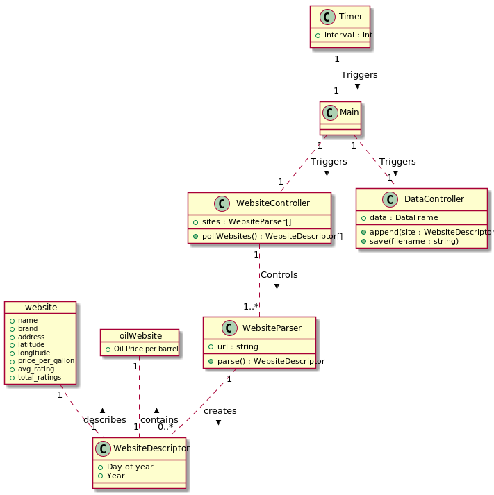

# Python Gas Price Webscraper

## Description
This project contains code for collecting gas price information from the internet, it saves it in a `pandas` dataframe
and then stores it in a csv file for later use.

## Contents
1. [Installation](#Installation)
1. [Data Layout](#Data-Layout)
2. [Module Breakdown](#Module-Breakdown)

# [Installation](#Installation)
To use the software all you have to do is run `main.py`.

To configure the websites that it uses modify the list inside of `defs.py`

To define your own parsers, see the `WebsiteParser.py` file.

## [Google api Parsers](#Google-api-Parsers)

The google api parsers operate by contacting the google maps servers using the `googlemaps` package, and requesting
nearby gas stations given some initial starting point (this is Cedar Rapids by default). You can change this. Once the
places have been found, then the place_ids are placed into [./places.json](./places.json) for faster loading times.
There is one place_id per line, you can add your own lines yourself, or re-run the search to find new ones.

# [Data Layout](#Data-Layout)
The csv file for the data storage contains the following columns:

* Day of the year (1-365)
* Year
* Store Name (Williams Blvd BP, etc...)
* Gasoline Brand (BP, Shell, etc...)
* Price per gallon
* Latitude
* Longitude
* Oil Price (Per Barrel)

The file is [./data.csv](./data.csv)

# [Module Breakdown](#Module-Breakdown)
The project architecture is broken down as follows [[source]](./architecture.puml):

